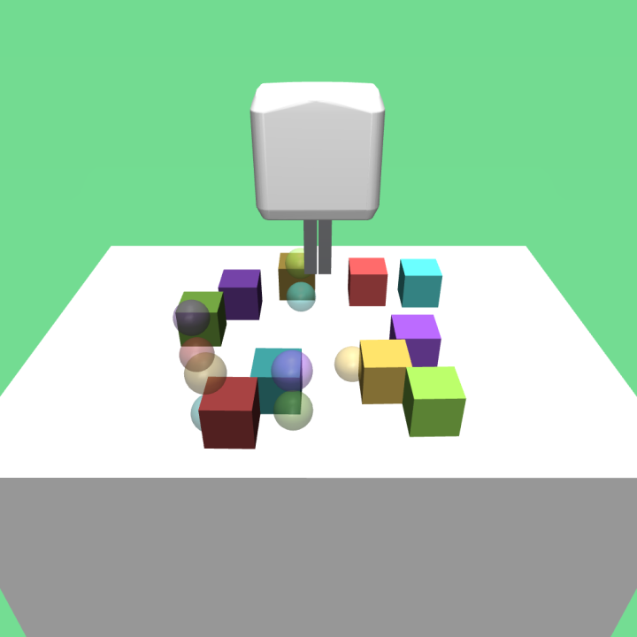

# Visual Block Builder

Visual RL environments for multi-object manipulation and block construction with a Fetch robot. 

<table>
  <tr>
    <td></td>
    <td></td>
    <td></td>
    <td></td>
  </tr> 
</table>

## Installation
The easiest way to install is to use the provided `create_conda_env.sh` script. This creates a conda environment called `vbb` with all the necessary dependencies, sets up MuJoCo and copies asset files.
```
./create_conda_env.sh
source ~/.bashrc
conda activate vbb
```

## Getting Started
To verify that the installation was successful, environments can be run with a random or user-controlled policy. An example command to control the robot on a pick-and-place task is:
``` 
python examples/run.py --policy user --num_blocks 3 --robot simplified --viewpoint frontview
```


## Configuration and Command Line Arguments
The following arguments are used to configure the environments and can be tested in `examples/run.py`:
- `case`: Selects which task to run and can be in `Singletower`, `Pyramid`, `Multitower`, and `All`.
- `num_blocks`: Number of blocks to use in the environment.
- `robot`: Selects which robot to use and can be in `simplified` and `default`. On the simplified robot, all parts but the gripper are invisible to make the task visually less complex.
- `stack_only`: Enforces object-goals to form a single stack on the `Singletower` task.
- `viewpoint`: Selects which viewpoint/camera to use and can be in `frontview` and `topview`, `external_camera_0`.


## Credits
This repository is an extension of the environments in [fetch-block-construction](https://github.com/richardrl/fetch-block-construction).